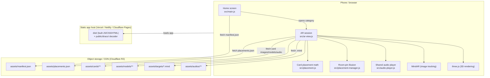

# System architecture

## Overview

This is a client-only web app: there is no application server and no
database. All logic runs in the browser. The "backend," such as it is, is a
static file host for the built app plus a static file host (object storage /
CDN) for the asset library. Two small local-only Node scripts exist purely to
support the content-authoring tools (see below) and never run in production.

## The three layers

### 1. The app (what ships to users)

Built by Vite from `src/` and `index.html` into `dist/`. This is a normal
single-page app: one HTML page, one JS entry point (`src/main.js`), styled by
`src/styles.css`. `dist/` is small (a few MB) because it contains only code —
none of the several-hundred-MB asset library.

### 2. The asset library (what the app fetches at runtime)

Card images, 3D models, compiled image-recognition files, and audio clips
live under `assets/` at the project root — deliberately **outside** `public/`,
so Vite never copies them into `dist/`. Locally, the dev/preview server
serves them straight from the project root. In production, they must be
served from somewhere else (typically Cloudflare R2), with the app told
where via the `VITE_ASSET_BASE` environment variable. See
[09_Deployment_Guide.md](09_Deployment_Guide.md).

### 3. The content-authoring tools (never shipped, never in production)

A separate set of browser pages and Node scripts under `tools/` that a
content maintainer uses locally to turn raw card/model files into the
compiled `.mind` targets and tuned `placements.json` the app needs. These
run on a second, separate local dev server (`npm run tools`) plus a tiny
write-back HTTP server (`npm run receiver`) — see
[14_Admin_Guide.md](14_Admin_Guide.md). None of this reaches users.

## Runtime data flow, step by step

1. `src/main.js` fetches `assets/manifest.json` and renders one tile per
   category.
2. The user taps a category. `src/main.js` dynamically imports
   `src/ar-view.js` (kept as a separate bundle chunk so the ~2.7 MB of AR/3D
   code is not downloaded until it's needed) and calls `startAR()`.
3. `startAR()`:
   - Fetches `assets/placements.json` (via `src/placement.js`).
   - Creates a `MindARThree` instance pointed at that category's
     `assets/targets/<id>.mind` file.
   - Registers one MindAR "anchor" per card in the category, in manifest
     order (order matters — MindAR identifies cards by numeric index).
   - Starts the camera.
4. When MindAR recognizes a card, it fires `onTargetFound` for that card's
   anchor. `src/ar-view.js` then:
   - Builds (or reuses a cached) three.js model via `src/placement.js`,
     which loads the card's `.glb` file, repairs missing normals if needed,
     applies Draco decompression, and orients/scales/positions it to match
     the printed card using the per-card (or per-deck) entry in
     `placements.json`.
   - Plays the card's audio clip through the single shared `Audio` element
     in `src/audio-player.js`.
5. Touch gestures on the model are handled by a Pointer-Events-based gesture
   controller inside `src/ar-view.js`, which only ever mutates a small
   per-card transform (rotation/scale/offset) that is separately persisted
   to `localStorage` via `src/transform-store.js`.
6. Tapping **Place Here** hands control of the model's position to
   `src/placement-manager.js`, which reparents it from its MindAR anchor
   into the plain three.js scene and counter-rotates its position every
   frame using the phone's device-orientation sensor, so it appears to stay
   fixed in the room. See
   [12_Known_Issues_and_Limitations.md](12_Known_Issues_and_Limitations.md)
   for exactly what this does and does not track.

## Key architectural decisions and why

| Decision | Why |
| --- | --- |
| Asset library kept outside `public/`, served separately | `assets/` is ~800 MB of runtime data (plus multi-GB of local-only originals). Vite copies `publicDir` into every build, so keeping the library inside it would make every build slow and every deploy carry hundreds of MB it doesn't need to. |
| One MindAR target file per **category**, not one for the whole library | MindAR's detection compares a camera frame against every target in the loaded file. Loading all ~500+ cards at once would make recognition slow and unreliable. Scoping to a category (recommended under ~25 cards) keeps it fast. |
| Models loaded and cached per card, one shared `<audio>` element for the whole app | Building all 500+ models or audio elements up front would be wasteful; instead each is built once, on first sighting, and reused for the rest of the session. |
| "Place Here" uses only the gyroscope, not WebXR/SLAM | A deliberate, documented product decision (recorded in project memory) to avoid the complexity and device-support gaps of true world tracking, accepting a known illusion that holds for turning in place but drifts if you walk. |
| Placement math lives in `src/placement.js`, shared by the app and the authoring tool (`tools/place-models.html`) | The two must agree exactly, or a card tuned in the editor would look different in the real AR view. Keeping one copy of the math guarantees this. |
| Two separate local dev servers (`vite`, `vite.tools.config.js`) | The app's dev server runs HTTPS (required for camera access) with a self-signed certificate, which a headless/automated browser can't get past. The authoring tool pages don't use the camera, so they run on a plain-HTTP server instead. The two also can't share Vite's cache directory without breaking each other, so the tools config uses its own `cacheDir`. |

## External dependencies

- **[MindAR](https://hiukim.github.io/mind-ar-js-doc/)** — image tracking:
  compiles printed card images into `.mind` target files and matches live
  camera frames against them.
- **[three.js](https://threejs.org/)** (r160) — WebGL 3D rendering, GLTF
  model loading, Draco decompression.
- **[Vite](https://vitejs.dev/)** — dev server and production bundler.
- **[@gltf-transform](https://gltf-transform.dev/) CLI** (dev-only) — used
  by `tools/compress-models.mjs` to Draco-compress and shrink 3D models.
- **rclone** (external binary, not an npm package) — used by
  `tools/upload-assets.mjs` to sync the asset library to Cloudflare R2.
- **Cloudflare R2** (or any S3-compatible/static host) — production home for
  the asset library; see [09_Deployment_Guide.md](09_Deployment_Guide.md).

## What this app deliberately does not have

- No application server, no REST/GraphQL API of its own, no database. See
  [05_API_Documentation.md](05_API_Documentation.md) for the small local
  HTTP surfaces that do exist (all authoring-only).
- No user authentication or accounts.
- No server-side rendering — it is a plain client-side single-page app.
