# Admin guide

This guide is for whoever maintains the flashcard library: adding new
decks, fixing cards that don't track well, tuning where models sit, and
publishing changes. It assumes you've already done
[07_Local_Setup_Guide.md](07_Local_Setup_Guide.md).

There is no admin panel in the app itself — "administration" here means
running scripts and using two browser-based tool pages against files on
disk, then uploading the result to the CDN.

## The full pipeline, end to end

```mermaid
flowchart LR
    A["Drop in card images,\n3D models, audio clips"] --> B["npm run validate\n(builds manifest.json)"]
    B --> C["npm run compress\n(shrinks models)"]
    C --> C2["npm run validate again\n(hashes model URLs)"]
    C2 --> D["Compile targets\n(compile-targets.html\nor compile-headless.js)"]
    D --> E["npm run check\n(tracking quality report)"]
    E --> F["Tune placements\n(place-models.html\nor solve-headless.js)"]
    F --> G["npm run upload\n(sync to CDN)"]
    G --> H["npm run check:cdn\n(verify live bucket)"]
```



## 1. Adding a new deck (category)

### File naming rules

```text
assets/cards/<category>/<card-name>.jpg   (or .jpeg / .png)
assets/models/<category>/<card-name>.glb
assets/audios/<category>/<card-name>.mp3  (or .m4a / .ogg / .wav — optional)
```

- **Names:** lowercase letters, digits, and hyphens only — no spaces, no
  capitals. Example: `cards/animals/red-panda.jpg` pairs with
  `models/animals/red-panda.glb`.
- **Pairing:** the image and model for one card must share the exact same
  base name. `npm run validate` will error on any mismatch.
- **Audio is optional per card**, but if present, the base name must match
  too. A card with no clip still works fine — its speaker button just stays
  disabled. A *misnamed* clip is treated as an error (not a warning), since
  the fix is a rename, not a missing recording.
- **Display names are automatic.** The card's spoken/displayed name is
  generated by title-casing its slug on hyphens — `leaning-tower-of-pisa`
  becomes "Leaning Tower Of Pisa." A short list of country-code acronyms
  (`uk`, `us`, `usa`, `uae`, `eu`) are upper-cased instead of title-cased —
  see `ACRONYMS` in `tools/validate-assets.mjs` if you need to add more.

### Image quality guidance

- Flat scans cropped to the card's border, no glare or shadow.
- At least 500px on the short side.
- Print masters above roughly 1200×1700 are wasted at runtime (MindAR
  downsamples anyway) and can exhaust the browser compiler's memory on a
  large deck — run `node tools/resize-cards.mjs <deck>` to bring them down.
  Originals are automatically backed up to `assets/cards-original/` the
  first time you resize, and every resize re-reads from that backup, so
  it's safe to re-run.
- **Feature-rich artwork tracks well. Flat colors and plain text track
  poorly.** This is the single most important thing to get right — see
  step 4 below and
  [12_Known_Issues_and_Limitations.md](12_Known_Issues_and_Limitations.md)
  for why recompiling can never fix a card whose art is the problem.

### Run the pipeline

```bash
npm install
npm run validate                      # naming/pairing errors
npm run compress                      # or: node tools/compress-models.mjs <deck> [deck...]
npm run validate                      # again: hashes each compressed model into its URL
npm run check                         # AFTER compiling targets — see step 4
npm run dev
```

`npm run compress` re-reads the pristine backup on every run, so re-running
it on the whole library is always safe — just slow (one `gltf-transform`
process per model). Name specific decks when only some have changed.

The second `validate` writes each model URL as `…/<card>.glb?v=<hash>`, using
the compressed file's content hash. Models are served with a one-year
immutable cache header, so a changed URL is the only thing that makes phones
fetch a replaced model.

### Replacing a wrong or damaged model

1. Copy the new source over **`assets/models-original/<deck>/<card>.glb`**
   (same name). Do **not** put it in `assets/models/`: compress always
   rebuilds from the backup and would overwrite it with the old model.
2. `node tools/compress-models.mjs assets/models/<deck>/<card>.glb` (list
   several paths to do a batch).
3. Re-solve only those cards' placement: with `npm run tools` and
   `npm run receiver` running, call
   `run(['<deck>'], {}, { only: ['<card>', …] })` from
   `tools/solve-headless.js`, then review each card in `place-models.html`
   Match view. The `month` deck is the exception: its solver result is
   unreliable, so keep the deck's hand-set pose (`heading: 270`,
   `fit: "contain"`) and check it by eye.
4. `npm run validate`, then `npm run upload -- models` and
   `npm run upload -- --json`, then `npm run check:cdn`.

Cards and `.mind` targets are unaffected, so there is no recompile.

### Replacing a wrong audio clip

1. Overwrite **`assets/audios/<deck>/<card>.mp3`** with the new clip. There is
   no backup folder or processing step for audio: the file you drop in is the
   file that ships. Keep the name identical to the card's slug — a typo means
   validate warns "has no audio clip" and `upload -- audios` (an rclone
   *sync*) deletes the correctly named live clip.
2. `npm run validate` — writes each audio URL as `…/<card>.mp3?v=<hash>`.
   Audio has the same one-year immutable cache header as models, so the hash
   is what makes phones fetch the new clip.
3. `npm run upload -- audios`, then `npm run upload -- --json`, then
   `npm run check:cdn`.

Cards, models, targets and placements are unaffected.

## 2. Compiling image targets (`.mind` files)

Start the tool server in its own terminal — this is deliberately a
**second, separate** dev server from the app's:

```bash
npm run tools
```

Open `http://localhost:5174/tools/compile-targets.html`, choose the
`assets/targets/` output folder, tick the categories you need, and compile.
Categories that already have a `.mind` file start unticked, so finished
work is never redone by accident.

**Why a second server?** The app's own dev server runs HTTPS (required for
camera access), and a headless/automated browser can't get past its
self-signed certificate. The tool pages never touch the camera, so they run
on plain HTTP instead — and the two servers must use separate Vite cache
directories (already configured in `vite.tools.config.js`) or they'll
corrupt each other's dependency cache.

### Running the tool pages without a human (scripted/agent-driven runs)

`tools/compile-headless.js` and `tools/solve-headless.js` do the same work
as the two tool pages with no UI — useful for scripted or agent-driven
runs. Both need two extra local processes:

```bash
npm run tools       # plain-HTTP Vite on :5174 for the tool pages
npm run receiver     # write-back server on :5999
```

They POST their output to `npm run receiver`
(`tools/receiver.mjs`) rather than using a directory picker or a download,
since a driven browser has nowhere else to put a file — see
[05_API_Documentation.md](05_API_Documentation.md) for exactly what that
server accepts. Without the receiver running, a driven run does all the
work and then fails at the last step with `receiver HTTP ...`.

Driving from a browser automation tool: run the module's `run()` without
awaiting it and poll its state object instead, since a compile or solve
call can take minutes (long enough to time out a single synchronous call):

```js
window.__m = await import('/tools/compile-headless.js');
window.__m.run(['fruits']);         // do NOT await
JSON.stringify(window.__m);         // (or window.__headless) — poll this
```

**Remember to re-run `npm run validate` and recompile the affected
category's targets whenever cards are added, renamed, or removed.** MindAR
anchors are index-based, so target order must exactly match manifest order
— `npm run check` will flag a mismatch as "targets vs cards" misalignment.

## 3. Checking tracking quality

```bash
npm run check
```

This is the check that catches problems nothing else can — see
[10_Testing_Guide.md](10_Testing_Guide.md) and
[12_Known_Issues_and_Limitations.md](12_Known_Issues_and_Limitations.md)
for the full explanation of the two numbers it reports (**features**,
**tracking**) and the thresholds it flags.

**The fix for a low-scoring card is always re-art, never recompile.**
Across the current library, the median card scores 191 features and 21
tracking points, so that's roughly what to aim for. Flat vector shapes,
large uniform color areas, and thin line work give the detector nothing to
hold onto — swap in a photo or a shaded illustration instead.

`npm run check` also flags any deck over 25 cards, since detection compares
a camera frame against every target in the loaded `.mind` file — a crowded
deck slows every scan and lets weak targets lose to their neighbors.
Splitting an oversized deck is a real, direct fix for "some cards in this
deck are never recognized."

### A subtlety with transparent card art

Card images are matted onto white before compiling
(`tools/load-card-image.js`). MindAR's compiler averages RGB into greyscale
and never reads alpha, and a fresh canvas starts transparent *black* — so
any transparent region of a card would otherwise compile as a solid black
frame that doesn't exist on the printed card, and that fake edge (the
strongest edge in the image) can dominate feature extraction. This was hit
for real with some `numbers` cards (rounded white artwork with a
transparent margin outside the corner radius).

## 4. Placing models on cards

Models stand **upright in the card plane** — up along the card's up axis,
front toward the camera — so a card viewed head-on shows the same view as
its printed picture. `assets/placements.json` controls where each model
sits, which way it faces, and how big it is; see
[04_Data_Model.md](04_Data_Model.md) for the full field reference.

Tune placements at `http://localhost:5174/tools/place-models.html` (served
by `npm run tools`):

1. **Solve deck** — matches every model's silhouette against its printed
   art and writes `orient`, `match`, and a `box` measured from the print
   itself.
2. **Review in Match view** — the exact head-on view the AR camera gets,
   with a model-opacity slider to compare against the print behind it. The
   card list is sorted worst-match-first, so start at the top.
3. **Fix stragglers** with the up-axis / heading / pitch / roll controls,
   then save.

If the solver picks the wrong subject, use the **preview** control next to
the mask threshold to see exactly what it masked, and adjust the threshold.
The preview renders through the same `src/placement.js` the real AR view
uses, so what you see there is what the camera will show.

### The solver match-score trap

<!-- prettier-ignore -->
> [!WARNING]
> A high `match` score does **not** mean a card is placed correctly. It only
> means the model's silhouette matches whatever the print mask found — not
> that the mask found the actual printed subject. The `month` deck once
> solved at a mean match of 0.90 with every single card wrong: its printed
> calendar is white-on-white, so the mask only ever saw the red header bar,
> and the solver happily matched a 3D word model edge-on to that bar.
>
> **After every solve, scan the boxes, not just the scores.** A box that's
> a thin strip, sits low on the card (`y > 0.62`), or covers under ~6% of
> the card has usually locked onto a caption ribbon, a title, or one bright
> fragment — not the subject.

A quick script to find suspicious boxes across the whole library:

```bash
node -e "const p=require('./assets/placements.json');for(const[k,v]of Object.entries(p))\
{if(k.endsWith('/*')||!v.box)continue;const[x,y,w,h]=v.box;\
if(w*h<0.06||y>0.62||h<0.15)console.log(k,v.match,JSON.stringify(v.box))}"
```

### Tuning a whole deck at once (deck defaults)

A whole deck scoring low usually means the **deck default box** is wrong,
not that the models themselves are bad. If the box reaches into a caption
ribbon or a title, the mask measures that too, and every card in the deck
solves against an inflated silhouette. `sweep()` tries a grid of thresholds
and boxes and reports the mean and worst match for each, **without writing
anything**:

```js
const m = await import('/tools/solve-headless.js');
await m.sweep('freedom-fighter', {
  thresholds: [42, 70],
  boxes: [null, [0.17, 0.22, 0.66, 0.44]]   // null = the deck's current default
});
```

Feed the winner back as per-deck tuning, which also rewrites that deck's
`<deck>/*` box so the editor starts from the corrected default going
forward:

```js
m.run(['freedom-fighter'], {
  'freedom-fighter': { threshold: 70, box: [0.17, 0.22, 0.66, 0.44] }
});
```

### Protecting hand-tuned cards from being overwritten

<!-- prettier-ignore -->
> [!IMPORTANT]
> A solve overwrites every key it touches, including `yaw`. The `locked`
> flag a card carries is **not actually read back as a guard** by the
> solver — see
> [12_Known_Issues_and_Limitations.md](12_Known_Issues_and_Limitations.md).
> The only real protection is `only`/`skip`, which hold specific cards out
> of a run entirely:

```js
m.run(['alphabets'], {}, { only: ['a-apple', 'b-ball', /* ... */] });
```

## 5. Publishing changes (uploading to the CDN)

Once assets are validated, compiled, checked, and placed:

```bash
npm run upload -- --dry-run     # preview what would transfer
npm run upload                  # sync to Cloudflare R2
npm run check:cdn               # verify the live bucket
```

See [09_Deployment_Guide.md](09_Deployment_Guide.md) for full details,
including one-time bucket setup and the environment variables required.
The manifest has a 60-second cache TTL, so a newly uploaded deck appears in
the live app within about a minute.

## 6. Maintenance checklist — after any content change

- [ ] `npm run validate` — no errors.
- [ ] `npm run compress` — new/changed models only, if you didn't already.
- [ ] `npm run validate` again after compress, so model URLs carry the new hashes.
- [ ] Targets compiled for every new/changed deck, matching manifest order.
- [ ] `npm run check` — no new WILL-NOT-TRACK entries; deck sizes still
      reasonable.
- [ ] Placements reviewed in Match view for anything the solver touched —
      don't trust the score alone.
- [ ] `npm run upload` then `npm run check:cdn` if deploying.
- [ ] Spot-check on a real phone before calling it done.

## Reference: project conventions worth knowing

- 300+ cards is the rough long-term scale this app was designed around;
  the library has grown to 30 categories and 541 cards as of the last
  recorded inventory.
- Every card is expected to eventually have an audio clip — as of the last
  inventory, all 541 cards do.
- The `canvas` npm package (a transitive dependency of `mind-ar`, used only
  for server-side image compiling this project never does) is stubbed out
  via an `overrides` entry in `package.json` because its native build fails
  on some machines — you should never need to build it.
